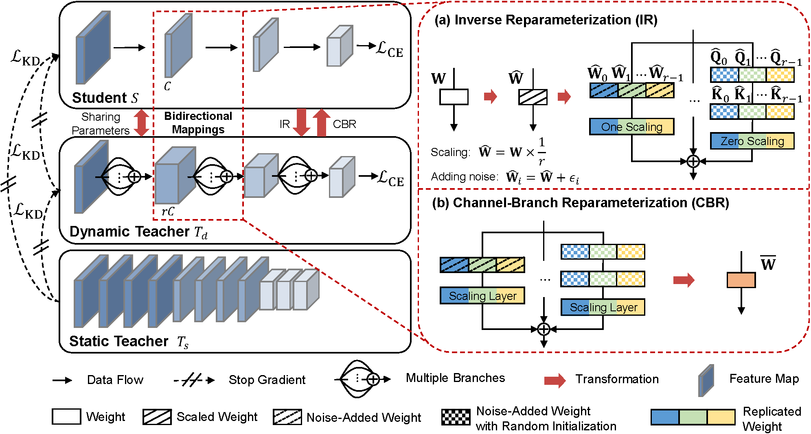

# Gap Preserving Distillation by building bidirectional mappings with a dynamic teacher

Guo Yong, Shulian Zhang, Haolin Pan, Jing Liu, Yulun Zhang, Jian Chen, "Gap Preserving Distillation by building bidirectional mappings with a dynamic teacher", 2024

[[arXiv](https://arxiv.org/html/2410.04140v1)] [[Project](https://princecafe.github.io/GPDwebsite/)]

#### 🔥🔥🔥 News
- **2024-02-14:** Code and pre-trained models are released. ⭐️⭐️⭐️
- **2024-01-23:** GPD is accepted at ICLR 2025. 🎉🎉🎉

---

> **Abstract:** Knowledge distillation aims to transfer knowledge from a large teacher model to a compact student counterpart, often coming with a significant performance gap between them. Interestingly, we find that a too-large performance gap can hamper the training process.
To alleviate this, we propose a **Gap Preserving Distillation (GPD)** method that trains an additional dynamic teacher model from scratch along with the student to maintain a reasonable performance gap. To further strengthen distillation, we develop a hard strategy by enforcing both models to share parameters. Besides, we also build the soft bidirectional mappings between them through ***Inverse Reparameterization (IR)*** and ***Channel-Branch Reparameterization (CBR)***.
IR initializes a larger dynamic teacher with approximately the same accuracy as the student to avoid a too large gap in early stage of training. CBR enables direct extraction of an effective student model from the dynamic teacher without post-training. 
In experiments, GPD significantly outperforms existing distillation methods on top of both CNNs and transformers, achieving up to 1.58\% accuracy improvement. 
Interestingly, GPD also generalizes well to the scenarios without a pre-trained teacher, including training from scratch and fine-tuning, yielding a large improvement of 1.80\% and 0.89\% on ResNet18, respectively.


Overview of the proposed Gap Preserving Distillation (GPD) method. Besides the static teacher, we introduce an additional dynamic teacher and train it from scratch along with the student. The student model shares parameters with the dynamic teacher via Inverse Reparameterization (IR) and Channel-Branch Reparameterization (CBR).

---

## Contents
1. [Requirements](#requirements)
2. [Checkpoints](#checkpoints) 
2. [Training](#training)
3. [Evaluation](#evaluation)
4. [Results](#results)
5. [Citation](#citation)
6. [Acknowledgements](#acknowledgements)

## <a name="requirements"></a> Requirements
- pytorch>1.8.0
- timm==0.6.13

## <a name="checkpoints"></a> Checkpoints
Available models in our [Release](https://github.com/guoyongcs/GPD/releases):
- Distillation with a static teacher

| Model              | ResNet34 → ResNet18      | ResNet50 → MobileNet     | RVT-S → RVT-Ti           |
|--------------------|--------------------------|--------------------------|--------------------------|
| **DKD + GPD**      | **[ckpt](https://github.com/guoyongcs/GPD/releases/download/v0.1/resnet18_dkd_gpd.pth.tar) (72.71)** | **[ckpt](https://github.com/guoyongcs/GPD/releases/download/v0.1/mobilenet_dkd_gpd.pth.tar) (73.63)** | **[ckpt](https://github.com/guoyongcs/GPD/releases/download/v0.1/rvt_tiny_gpd.pth.tar) (80.14)** |


## <a name="training"></a> Training
GPD supports three training scenarios:
1. Distillation with a static teacher
2. Training from scratch without a teacher
3. Fine-tuning from a pretrained model

### GPD for CNNs (Located in the `CNN` directory)

#### Distillation with static teacher
To train the student models, first download the pre-trained teacher models from Release and place them in the `pretrained` folder. Then, change to the `CNN` directory and run the following commands:

1. Distill ResNet18 from ResNet34 using DKD
```
torchrun --nproc_per_node=4 --master_port=12375 train_dkd.py --net_version resnet18 --checkpoint_dir ../out --train_data_dir /datab/iedl/imagenet --model-ema --gpd_ratio 2 --epoch_init 100 --kd_loss_type sce --teacher resnet34 --teacher-weight ../pretrained/resnet34-333f7ec4.pth --use_dkd --use_orepa --learning_rate 0.1 --kd_ratio 3
```

2. Distill ResNet18 from ResNet34 using ReviewKD
```
torchrun --nproc_per_node=4 --master_port=12377 train_reviewkd.py --net_version resnet18 --checkpoint_dir ../out --train_data_dir /datab/iedl/imagenet --model-ema --gpd_ratio 2 --epoch_init 100 --kd_loss_type sce --teacher resnet34 --teacher-weight ../pretrained/resnet34-333f7ec4.pth --use_reviewkd --use_orepa --learning_rate 0.1 --kd_ratio 3
```

3. Distill MobileNet from ResNet50 using DKD
```
torchrun --nproc_per_node=4 --master_port=12374 train_dkd.py --net_version MobileNet --checkpoint_dir ../out --train_data_dir /datab/iedl/imagenet --model-ema --gpd_ratio 2 --epoch_init 100 --kd_loss_type sce --teacher resnet50 --teacher-weight ../pretrained/resnet50-19c8e357.pth --use_dkd --use_orepa --learning_rate 0.1 --kd_ratio 3
```

4. Distill MobileNet from ResNet50 using ReviewKD
```
torchrun --nproc_per_node=4 --master_port=12376 train_reviewkd.py --net_version MobileNet --checkpoint_dir ../out --train_data_dir /datab/iedl/imagenet --model-ema --gpd_ratio 2 --epoch_init 100 --kd_loss_type sce --teacher resnet50 --teacher-weight ../pretrained/resnet50-19c8e357.pth --use_reviewkd --use_orepa --learning_rate 0.1 --kd_ratio 3
```


##### Train from scratch
Change to the `CNN` directory and run:

1. Train ResNet18
```
torchrun --nproc_per_node=4 --master_port=12372 train_dkd.py --net_version resnet18 --checkpoint_dir ../out --train_data_dir /root/dataset/imagenet --model-ema --gpd_ratio 2 --epoch_init 100 --kd_loss_type sce --use_orepa --learning_rate 0.1 --kd_ratio 3
```


2. Train MobileNet
```
torchrun --nproc_per_node=4 --master_port=12369 train_dkd.py --net_version MobileNet --checkpoint_dir ../out --train_data_dir /root/dataset/imagenet --model-ema --gpd_ratio 2 --epoch_init 100 --kd_loss_type sce --use_orepa --learning_rate 0.1 --kd_ratio 3
```


##### Finetuning
Download pretrained models from [Release](https://github.com/guoyongcs/GPD/releases) and place them in the`pretrained` folder. Then, change to the `CNN` directory and run:

1. Finetune ResNet18
```
torchrun --nproc_per_node=4 --master_port=12372 train_dkd.py --net_version resnet18 --checkpoint_dir ../out --train_data_dir /root/dataset/imagenet --model-ema --gpd_ratio 2 --epoch_init 50 --kd_loss_type sce --lr-warmup-epochs 0 --use_orepa --learning_rate 0.01 --load_tiny_model_file_path ../pretrained/resnet18-f37072fd.pth --kd_ratio 3
```

2. Fine-tune MobileNet
```
torchrun --nproc_per_node=4 --master_port=12373 train_dkd_ensemble.py --net_version MobileNet --checkpoint_dir ../out --train_data_dir /root/dataset/imagenet --model-ema --gpd_ratio 2 --epoch_init 50 --kd_loss_type sce --use_orepa --learning_rate 0.01 --load_tiny_model_file_path ../pretrained/mobilenet_sgd_68.848.pth.tar --kd_ratio 3
```

### GPD for ViTs (Located in the `RVT` directory)

##### Distillation with static teacher
First, download the pre-trained teacher models rvt_small from [Release](https://github.com/guoyongcs/GPD/releases) and place them in the `pretrained` folder. Then, change to the `RVT` directory and run:

1. Distill RVT-Ti from RVT-S using DKD
```
python -m torch.distributed.launch --nproc_per_node=8 --master_port 12348 main_gpd.py --model rvt_tiny --data-path /datab/iedl/imagenet --output_dir ../out --dist-eval --batch-size 256 --gpd_ratio 2 --kd_loss_type sce --use_orepa --kd_ratio 3 --use_dkd --teacher rvt_small --teacher-weight ../pretrained/rvt_small.pth
```


2. Distill RVT-Ti from RVT-S using ReviewKD
```
python -m torch.distributed.launch --nproc_per_node=8 --master_port 12348 main_gpd.py --model rvt_tiny --data-path /datab/iedl/imagenet --output_dir ../out --dist-eval --batch-size 256 --gpd_ratio 2 --kd_loss_type sce --use_orepa --kd_ratio 3 --use_reviewkd --teacher rvt_small --teacher-weight ../pretrained/rvt_small.pth
```


##### Train from scratch
Change to the `RVT` directory and run:

- Train RVT-Ti
```
python -m torch.distributed.launch --nproc_per_node=8 --master_port 12348 main_gpd.py --model rvt_tiny --data-path /datab/iedl/imagenet --output_dir ../out --dist-eval --batch-size 256 --gpd_ratio 2 --kd_loss_type sce --use_orepa --kd_ratio 3 
```

##### Fine-tuning
Download pretrained models from [Release](https://github.com/guoyongcs/GPD/releases) and place them in the`pretrained` folder. Then, change to the `RVT` directory and run:

Finetune RVT-Ti
```
python -m torch.distributed.launch --nproc_per_node=8 --master_port 12348 main_gpd.py --model rvt_tiny --data-path /datab/iedl/imagenet --output_dir ../out --dist-eval --batch-size 256 --gpd_ratio 2 --kd_loss_type sce --use_orepa --kd_ratio 3 --lr 5e-5 --epochs 50 --pretrain_path ../pretrained/rvt_ti.pth --eval-first
```

## <a name="Evaluation"></a> Evaluation
You can evaluate the trained model directly or after converting it from a training-time model to an inference-time model.

- Evaluation for CNNs (Located in the `CNN` directory)

1. Direct Evaluation

You can use your self-trained model or our pretrained model provided in our [Release](https://github.com/guoyongcs/GPD/releases).
Run the following command to evaluate a model:
```
python test.py --model resnet18 --load_model_file_path pretrained/model/path --train_data_dir dataset/imagenet --batch_size 512 --use_orepa --gpd_ratio 2
```
Note: The `--model` option supports resnet18 and MobileNet.


2. Evaluation after model conversion

This command first converts the model to its inference-time version and then evaluates it:
```
python test.py --model resnet18 --load_model_file_path pretrained/model/path --train_data_dir dataset/imagenet --batch_size 512 --use_orepa --gpd_ratio 2 --deploy --deploy_model_path ./deployed_model.pth.tar
```

- Evaluation for ViTs (Located in the `RVT` directory)
1. Direct Evaluation

```
python main_gpd.py --model rvt_tiny --data-path dataset/imagenet --batch-size 256 --gpd_ratio 2 --eval --load_model_file_path ./ckpts/rvt_tiny_dkd_gpd.pth.tar
```


2. Evaluation after model conversion

This command first converts the model to its inference-time version and then evaluates it:
```
python main_gpd.py --model rvt_tiny --data-path dataset/imagenet --batch-size 256 --gpd_ratio 2 --eval --load_model_file_path ./ckpts/rvt_tiny_dkd_gpd.pth.tar --deploy --deploy_model_path ./deployed_model.pth.tar
```

## <a name="results"></a> Results
We achieved state-of-the-art performance. Detailed results can be found in the paper.
- Distillation with static teacher

| Model                 | ResNet34 → ResNet18 | ResNet50 → MobileNet | RVT-S → RVT-Ti    |
|-----------------------|---------------------|----------------------|-------------------|
| **Teacher**           | 73.31               | 76.16                | 81.69             |
| **Student**           | 69.75               | 68.87                | 78.45             |
| **ReviewKD**          | 71.61               | 72.56                | 78.92             |
| **ReviewKD + GPD**    | **72.50 (+0.89)**   | **73.21 (+0.65)**    | **80.01 (+1.09)** |
| **DKD**               | 71.70               | 72.05                | 79.12             |
| **DKD + GPD**         | **72.71 (+1.01)**   | **73.63 (+1.58)**    | **80.14 (+1.02)** |

- Train from scratch

| Model        | ResNet18          | MobileNet         | RVT-Ti            |
|--------------|-------------------|-------------------|-------------------|
| **Baseline** | 70.07             | 71.68             | 78.45             |
| **GPD***     | **71.87 (+1.80)** | **73.07 (+1.39)** | **79.85 (+1.40)** |

- Fine-tuning

| Model                           | ResNet18    | MobileNet    | RVT-Ti             |
|---------------------------------|-------------|--------------|--------------------|
| **Pretrained Model**            | 69.75       | 68.87        | 78.45              |
| **Fine-Tuning with Longer Training** | 70.23       | 69.01        | 78.61              |
| **GPD***                        | **71.12 (+0.89)** | **69.47 (+0.46)** | **78.84 (+0.23)**  |


## <a name="citation"></a> Citation
If you find our work useful for your research, please consider citing:

```
@inproceedings{
guo2025gap,
title={Gap Preserving Distillation by Building Bidirectional Mappings with A Dynamic Teacher},
author={Yong Guo and Shulian Zhang and Haolin Pan and Jing Liu and Yulun Zhang and Jian Chen},
booktitle={The Thirteenth International Conference on Learning Representations},
year={2025},
url={https://openreview.net/forum?id=PnfghHD4Pi}
}
```

## <a name="acknowledgements"></a> Acknowledgements
This code is built based on [OREPA](https://github.com/JUGGHM/OREPA_CVPR2022), [DKD](https://github.com/megvii-research/mdistiller) and [ReviewKD](https://github.com/dvlab-research/ReviewKD).
We thank the authors for their excellent projects.
